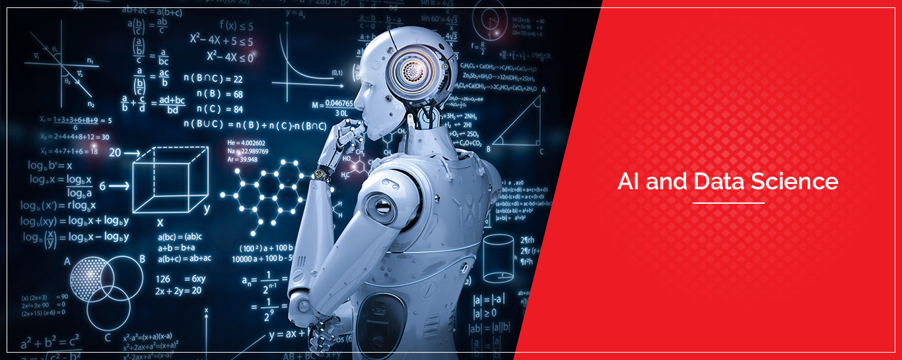

   

  

# Marcos Conrado

  
  <a href="https://github.com/MarcosConrado">
  
    

  
  
 
 
  
 

  

 
  
  
  

 
## 
  

  
  
## Cientista de dados em evolução
  

  
Atualmente não estou trabalhando na área mas como um grande entusiasta de tecnologia e principalmente AI, tenho focado meus estudos nessa área.
   Com foco na especialização em Machine Learning,Deep Learning e robótica.

**Background in:**  🐍**Python**, 🤖**Machine Learning**, 📊**Power Bi** e 📚**SQL**.

**Links:**
  
* [LinkedIn](https://www.linkedin.com/in/marcossconrado) 
* [Blog]
* [Kagle]

## Projetos:

---
